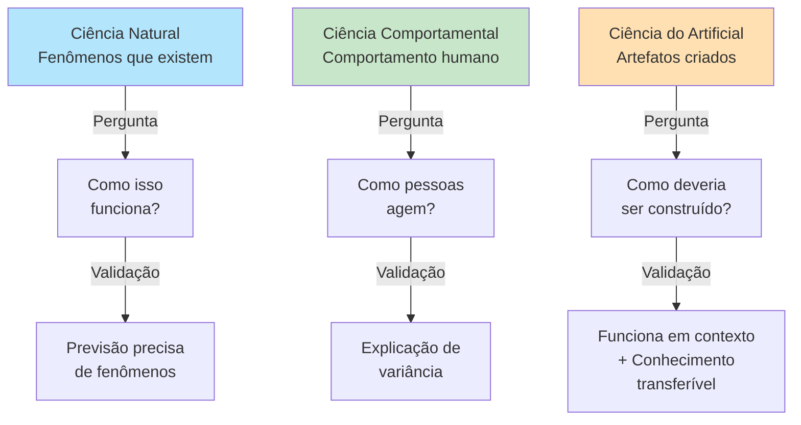

# Capítulo 2: Fundamentos Epistemológicos

## A Tríade das Ciências: Natural, Comportamental e Artificial

Herbert Simon, em seu livro seminal *The Sciences of the Artificial* (1969), propôs uma distinção que ainda estrutura o pensamento sobre ciência do design. Ele argumentava que existem fundamentalmente **três tipos de empreendimento científico**, cada um com suas próprias perguntas centrais, métodos de validação e critérios de rigor.

### Ciência Natural

A **ciência natural** investiga fenômenos que existem independentemente da ação humana. Um físico estuda como a luz se comporta, um biólogo estuda como os organismos evoluem, um geólogo estuda a formação de rochas. A pergunta central é sempre "Como isso funciona?". 

O conhecimento é validado mediante observação cuidadosa, experimentação controlada e reprodutibilidade. A ciência natural assume que existe uma realidade objetiva que pode ser compreendida através de método científico. O mundo existe; a ciência tenta explicá-lo.

**Exemplos de investigação natural:**
- Lei da gravitação (Newton)
- Evolução por seleção natural (Darwin)
- Estrutura do DNA (Watson & Crick)

### Ciência Comportamental

A **ciência comportamental** investiga o comportamento de seres humanos e organizações. Um psicólogo estuda como pessoas aprendem, um economista estuda como agentes fazem escolhas, um sociólogo estuda padrões de interação. A pergunta também é frequentemente "Como isso funciona?", mas o objeto é a ação e a decisão humanas, que são deliberativas, contextadas e frequentemente irracionais.

Há rigor metodológico similar ao da ciência natural — delineamentos experimentais, amostragem cuidadosa, testes estatísticos — mas o fenômeno estudado é mais complexo porque envolve agência humana. Comportamento é observável e previsível em certos contextos, mas com menor determinismo que fenômenos naturais.

**Exemplos de investigação comportamental:**
- Racionalidade limitada em tomada de decisão (Simon)
- Vieses cognitivos (Kahneman & Tversky)
- Dinâmica de grupo e conformidade social (Asch, Milgram)

### Ciência do Artificial (ou Design Science)

A **ciência do artificial** (ou design science) investiga artefatos — coisas que não existem na natureza e que foram deliberadamente criadas por seres humanos para atingir objetivos. Um arquiteto projeta um edifício, um engenheiro projeta um motor, um cientista de computação projeta um algoritmo. 

A pergunta central não é "Como isso funciona?", mas "Como **deveria ser construído** para atingir estes objetivos em este contexto específico?". O conhecimento não emerge apenas da observação do que existe, mas da **construção refletida do que deveria existir**.

**Exemplos de investigação artificial:**
- Padrões de arquitetura de software
- Métodos de desenvolvimento ágil
- Algoritmos de compressão de dados
- Interfaces de usuário para sistemas complexos

## Rigor Científico em Cada Domínio

Essa distinção é mais que semântica. Ela muda fundamentalmente os **critérios de rigor científico** apropriados para cada tipo de investigação.

Uma **ciência natural** valida uma teoria mostrando que suas previsões coincidem com o comportamento observado. A gravidade é "verdadeira" porque consegue prever o movimento de corpos celestes com precisão extrema.

Uma **ciência comportamental** valida um modelo mostrando que explica variância significativa em dados reais e que consegue prever comportamento em novos contextos. Uma teoria de vieses cognitivos é "válida" se consegue prever como pessoas tomarão decisões iracionais em situações específicas.

Uma **ciência do artificial** valida artefatos mostrando que eles funcionam conforme especificado em contextos relevantes e, **mais importante, que sua construção produziu conhecimento que transcende aquele artefato específico**. Um padrão arquitetural é "válido" não apenas se funciona em um contexto, mas se oferece diretrizes que funcionam em múltiplos contextos similares e se ajuda a explicar por que certas soluções funcionam melhor que outras sob certas condições.

## Por que Design Science Research Importa em Computação

Design Science Research é particularmente relevante em Computação porque a área é fundamentalmente ciência do artificial — nós criamos coisas. O software, os algoritmos, as arquiteturas que desenvolvemos são todos artefatos.

Mas nem toda criação de artefatos é pesquisa científica. Uma empresa que desenvolve um produto de software está fazendo engenharia. Um pesquisador que investiga sistematicamente como construir artefatos dessa classe de forma que produz conhecimento generalizável está fazendo Design Science Research.

A questão crucial é: **após construir e avaliar aquele artefato, que aprendemos que não sabíamos antes e que transcende aquele artefato específico?**

Se a resposta é "apenas que conseguimos fazer funcionar naquele contexto", é engenharia. Se a resposta é "aprendemos princípios sobre como construir artefatos dessa classe sob essas condições", é pesquisa em Design Science.

---

## Conexões com Outros Capítulos

- **Capítulo 1** contextualiza por que DSR importa; este capítulo oferece fundação teórica
- **Capítulo 3** detalha como implementar rigor em pesquisa DSR
- **Capítulo 6** descreve metodologias de avaliação específicas a DSR

---

## Resumo

| Aspecto | Ciência Natural | Ciência Comportamental | Design Science |
|--------|-----------------|----------------------|-----------------|
| **Objeto** | Fenômenos naturais | Comportamento humano | Artefatos criados |
| **Pergunta Central** | Como funciona? | Como as pessoas agem? | Como deveria ser construído? |
| **Validação** | Previsão precisa | Explicação de variância | Funcionalidade + conhecimento |
| **Contexto** | Menos dependente | Altamente dependente | Dependente e contextual |

---

## Exercício Correspondente

Trabalhe o **Exercício 2** do arquivo de exercícios práticos: "Definição de Objetivos de Design". Ele pedirá que você transforme um problema em objetivos de design mensuráveis.

---

## Leitura Complementar

- Simon, H. A. (1996). *The Sciences of the Artificial* (3rd ed.). MIT Press. — Obra seminal
- Hevner et al. (2004) — Conexão entre design science e SI

---

**Anterior:** [Capítulo 1: Introdução](01_introducao.md)  
**Próximo:** [Capítulo 3: Problemas, Artefatos e Contribuições →](03_problemas_artefatos.md)
