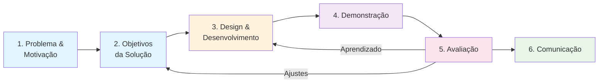
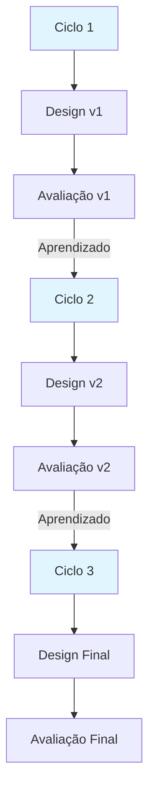

# Capítulo 4: O Processo DSRM de Peffers

## Visão Geral do DSRM

A **Design Science Research Methodology (DSRM)**, formulada por Peffers e colegas em 2007, é um dos frameworks mais influentes para estruturar pesquisa DSR. Oferece uma sequência clara de fases que guiam o pesquisador do problema inicial até comunicação dos resultados.

O DSRM consiste em **6 fases principais**:

## As 6 Fases

### 1. Identificação do Problema e Motivação

Nesta fase, você articula **claramente qual é o problema** que sua pesquisa aborda, **por que importa** (para a prática, para a ciência ou ambos), e **que conhecimento existente é relevante**.

Perguntas a responder:
- Qual é o problema prático que motiva este trabalho?
- Qual é a lacuna científica?
- Por que este problema importa?
- Como situações similares foram abordadas anteriormente?

**Entregáveis:** Documento de problema bem articulado, referências a trabalhos relacionados iniciais.

### 2. Definição dos Objetivos da Solução

Baseado no problema e no conhecimento existente, você articula **explicitamente o que a solução deveria alcançar**.

Objetivos frequentemente são expressos em termos:
- **Quantitativos:** reduzir latência em 30%, aumentar precisão para > 95%
- **Qualitativos:** melhorar usabilidade para usuários não-técnicos

Objetivos bem definidos guiam tanto o design quanto a avaliação.

**Entregáveis:** Objetivos de design específicos e mensuráveis, métricas associadas.

### 3. Design e Desenvolvimento

Aqui você constrói o artefato. Construção **fundamentada** significa que cada decisão de design é informada por teoria, por conhecimento prévio ou por princípios de design identificados.

Não é simplesmente implementar; é **argumentar por que cada escolha é apropriada**.

**Entregáveis:** Artefato funcional (software, método, modelo, etc.), documentação de decisões de design, justificativas teóricas.

### 4. Demonstração

Você apresenta o artefato funcionando em um **contexto relevante**. Pode ser:
- Ambiente controlado (laboratório)
- Ambiente real (uma organização)
- Simulado (dataset que emula características reais)

Demonstração estabelece que o artefato **pode, de fato, funcionar**.

**Entregáveis:** Demonstração funcional, cenários de uso, evidence que funciona conforme especificado.

### 5. Avaliação

Você **compara sistematicamente o desempenho do artefato contra os objetivos** que definiu. Responde rigorosamente: "O artefato alcança os objetivos? Em que condições? Quais trade-offs faz?"

Sem avaliação rigorosa, você não tem evidência de que o design funcionou.

**Entregáveis:** Resultados de avaliação, métricas mensuradas, análise de dados, comparação contra objectives.

### 6. Comunicação

Você articula os resultados em forma que a comunidade científica e os práticos podem compreender, reproduzir e construir sobre eles. Tipicamente significa:
- Artigos científicos
- Dissertações/teses
- Documentação técnica estruturada

**Entregáveis:** Publicação em formato apropriado, documentação reproduzível.

## Iteração vs. Linearidade

**Importante:** O DSRM **não é necessariamente linear**. Na prática, a maioria das pesquisas DSR envolvem ciclos:

Você projeta → avalia → aprende algo → redesenha → avalia novamente.

Essa iteração é natural e esperada. O DSRM fornece uma estrutura que vale para **cada ciclo**, mas **múltiplos ciclos podem ocorrer** em uma mesma pesquisa.

---

## Exemplo Prático: Sistema de Priorização de Alertas SOC

**Fase 1 — Problema:** Centers de Operações de Segurança enfrentam centenas de milhares de alertas/dia. 97% são false positives. Analistas sofrem fadiga. Ameaças reais são perdidas. Lacuna científica: princípios de design para sistemas de priorização que balanceiem precisão, recall e carga cognitiva.

**Fase 2 — Objetivos:** Reduzir alertas revisados em 40% (mantendo recall > 95%), reduzir tempo de triagem de 5 min para 2 min, receber feedback positivo de analistas.

**Fase 3 — Design:** Arquitetura com 3 camadas: filtro de regras determinístico, modelo de ML adaptativo, enriquecimento de contexto.

**Fase 4 — Demonstração:** Processamento de 1000 alertas históricos. Sistema descarta 76%, apresenta 240 para revisão. Especialistas confirmam 98% dos descartados eram realmente falsos positivos.

**Fase 5 — Avaliação:** Avaliação artificial (dados históricos), formativa (testes com analistas), naturalística (produção por 4 semanas). Resultados: objetivos alcançados.

**Fase 6 — Comunicação:** Dissertação/tese relatando problema, design, avaliação e design principles extraídos.

---

## Conexões com Outros Capítulos

- **Capítulo 3** define problemas e artefatos que alimentam o DSRM
- **Capítulo 5** oferece perspectiva complementar (ciclos de Hevner)
- **Capítulo 6** detalha como conduzir Fase 5 (avaliação)

---

## Resumo

| Fase | Pergunta Central | Entregável |
|------|------------------|-----------|
| 1 | Qual é o problema? | Problema bem articulado |
| 2 | Que a solução deve fazer? | Objetivos mensuráveis |
| 3 | Como construir a solução? | Artefato + justificativas |
| 4 | O artefato funciona? | Demonstração funcional |
| 5 | Atinge os objetivos? | Resultados de avaliação |
| 6 | Como comunicar? | Publicação/documentação |

---

## Exercício Correspondente

Trabalhe o **Exercício 2** (Definição de Objetivos) e **Exercício 3** (Desenho de Avaliação) do arquivo de exercícios práticos.

---

**Anterior:** [Capítulo 3: Problemas e Artefatos](03_problemas_artefatos.md)  
**Próximo:** [Capítulo 5: Ciclos de Hevner →](05_ciclos_hevner.md)
