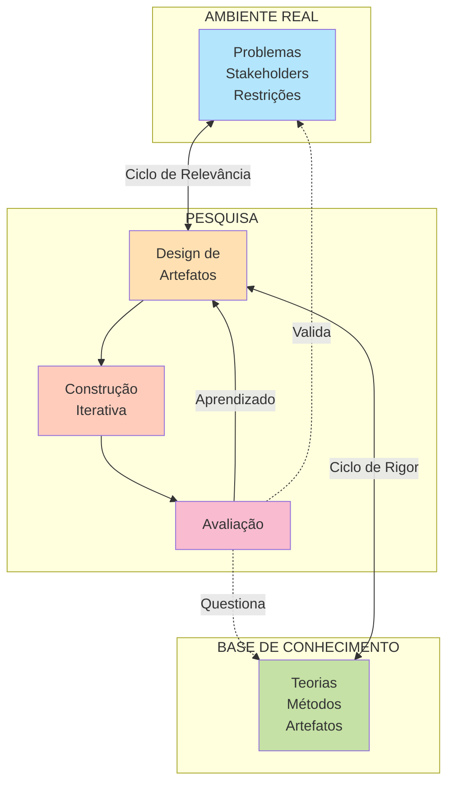

# Capítulo 5: Os Ciclos de Hevner

## Complementando o DSRM

Enquanto o DSRM de Peffers fornece uma estrutura sequencial, Alan Hevner propôs uma visão mais cíclica e equilibrada: três dimensões simultâneas que devem estar em constante diálogo durante pesquisa DSR.

## Os Três Ciclos

### Ciclo de Relevância

Conecta a pesquisa ao **ambiente real**. Você continuamente valida que o problema que está resolvendo é relevante na prática.

**Perguntas guia:**
- O problema que identificamos é de fato um problema real?
- Pessoas/organizações realmente precisam de solução?
- Qual são as restrições e oportunidades do ambiente?
- Os stakeholders confirmam que a solução é útil?

**Atividades:**
- Observação em ambiente
- Entrevistas com stakeholders
- Validação de requisitos
- Feedback contínuo durante desenvolvimento

**Risco se negligenciado:** Você pode resolver um problema que ninguém realmente enfrenta, produzindo artefato interessante mas cientificamente irrelevante.

### Ciclo de Rigor

Conecta a pesquisa ao **corpo de conhecimento existente**. Você continuamente consulta teorias, métodos e artefatos já documentados.

**Perguntas guia:**
- O que já existe sobre este problema?
- Que teorias são relevantes?
- Que métodos estabelecidos podem informar nosso design?
- Como nosso trabalho contribui ao corpo de conhecimento?

**Atividades:**
- Revisão sistemática de literatura
- Compreensão profunda de fundações teóricas
- Diálogo com trabalhos relacionados
- Identificação de lacunas científicas

**Risco se negligenciado:** Você pode reinventar o que já existe, ou violar princípios teóricos estabelecidos, produzindo artefato que parece novo mas não contribui cientificamente.

### Ciclo de Design

Conecta a **construção refletida ao teste e aprendizado**. Você propõe solução, a constrói, a avalia em contexto controlado, aprende, refina e repete.

**Perguntas guia:**
- Como projetar artefato que atinge objetivos?
- O prototipo funciona conforme especificado?
- Qual feedback dos usuários/testes?
- Como refinar baseado no aprendizado?

**Atividades:**
- Prototipagem iterativa
- Testes em laboratório
- Feedback de usuários
- Refinamento de design

**Risco se negligenciado:** Design pode ser não-reflexivo, repetindo padrões conhecidos sem justificação teórica, produzindo artefato funcional mas não generalizável.

## Como os Ciclos Interagem

Os três ciclos **não ocorrem sequencialmente; eles ocorrem em paralelo**, alimentando-se mutuamente:

- Uma descoberta no **ciclo de design** (prototipo falhou em X) pode exigir revisão da literatura no **ciclo de rigor** (talvez haja teoria que explique por que X falhou)
- Uma observação no **ciclo de relevância** (stakeholders precisam de Y) pode abrir novas possibilidades de design no **ciclo de design**
- Um novo conhecimento em uma teoria relevante (ciclo de rigor) pode questionar suposições de design

## Por que Ambos DSRM e Ciclos de Hevner?

**DSRM** oferece: sequência clara, checklist de fases, estrutura linear.

**Ciclos de Hevner** oferem: perspectiva de que nenhum ciclo é negligenciável, visão de como realimentação ocorre, compreensão de trade-offs.

**Melhor prática:** Use ambos. Organize seu trabalho como DSRM (fases), mas continuamente veja se está balanceando todos os ciclos de Hevner.

---

## Conexões com Outros Capítulos

- **Capítulo 4** (DSRM) oferece sequência, enquanto este oferece perspectiva cíclica
- **Capítulo 6** (Avaliação) detém como executar ciclo de design rigorosamente

---

## Resumo

| Ciclo | Foco | Risco se Negligenciado |
|-------|------|----------------------|
| **Relevância** | Ambiente real | Soluciona problema inexistente |
| **Rigor** | Conhecimento científico | Reinventa o conhecido |
| **Design** | Construção iterativa | Design não-reflexivo |

---

**Anterior:** [Capítulo 4: Processo DSRM](04_processo_dsrm.md)  
**Próximo:** [Capítulo 6: Avaliação em DSR →](06_avaliacao.md)
