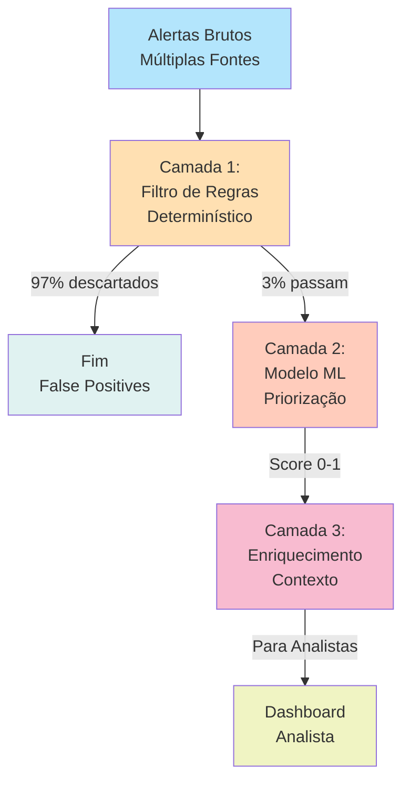

# Estudos de Caso: Design Science Research em Prática

## Estudo de Caso 1: Sistema de Priorização de Alertas em SOC

### Contexto e Motivação

Um banco de grande porte opera um Security Operations Center (SOC) responsável por monitorar ameaças de segurança em toda sua infraestrutura. A operação envolve aproximadamente 50 analistas de segurança que trabalham em turnos 24/7. A infraestrutura gera centenas de milhares de alertas diários, originários de firewalls, sistemas de prevenção de intrusão (IPS), ferramentas de detecção de comportamento anômalo, logs de aplicações e sensores de segurança endpoint.

Um dos problemas críticos que o banco enfrentava era sobrecarga de alertas. Os analistas recebiam tantos alertas que era impossível revisar todos com cuidado. Estudos internos mostraram que aproximadamente 97% dos alertas eram false positives — atividades normais de negócio que o sistema de detecção havia sinalizado incorretamente. Consequências: (1) analistas desenvolviam fadiga e descartavam alertas sem revisão adequada, (2) ameaças genuínas podiam ser perdidas no ruído, (3) ciclo de investigação era extremamente longo, (4) custo operacional era alto.

### Problema em Perspectiva DSR

**Problema Prático:** Analistas do SOC enfrentam sobrecarga de false positive alerts, resultando em fadiga, redução de efetividade na detecção de ameaças reais, e ineficiência operacional. Custo anual de operação era aproximadamente 40% maior que o benchmark de indústria, especialmente por overhead de revisão manual.

**Lacuna Científica:** Embora haja muita literatura sobre detecção de ameaças e sobre redução de false positives através de tuning de sensores, há lacuna significativa em conhecimento sistemático sobre como desenhar e avaliar **sistemas de triagem e priorização de alertas que equilibrem precisão técnica, recall de ameaças reais, e carga cognitiva dos operadores**, especialmente em contextos com grande volume, alta diversidade de fontes, e evolução contínua de padrões de ataque.

### Objetivos de Design

O trabalho DSR articula cinco objetivos de design:

**Objetivo 1 (Eficácia de Triagem):** O sistema deveria reduzir em pelo menos 60% o número de alertas que um analista precisa revisar manualmente, mantendo recall de ameaças reais (capacidade de não ignorar ameaças genuínas) em pelo menos 95%. Métrica: Proporção de alertas descartados automaticamente que eram realmente falsos positivos (precisão da filtragem), validado em dataset histórico de 6 meses.

**Objetivo 2 (Qualidade de Priorização):** Quando um alerta passa pela filtragem e chega ao analista, o sistema deveria ajudar a priorizar sua urgência corretamente. Sistemas similares na indústria tipicamente acertam prioridade em 75%; o objetivo era 88%. Métrica: Correlação entre score de prioridade do sistema e tempo que o analista leva para determinar se é ameaça real.

**Objetivo 3 (Usabilidade e Confiança):** Analistas devem ser capazes de compreender por que um alerta foi marcado como baixa prioridade ou descartado. Objetivo: 85% dos analistas, quando questionados, conseguem articularar corretamente a razão. Métrica: Teste de compreensão com 10 analistas de diferentes níveis de experiência.

**Objetivo 4 (Performance Operacional):** Tempo médio para triagem de um alerta deveria reduzir de 5 minutos (baseline histórico) para 2 minutos. Métrica: Tempo médio em produção ao longo de 3 meses.

**Objetivo 5 (Impacto em Detecção Real de Ameaças):** Em produção, o sistema deveria melhorar taxa de detecção de ameaças reais. Embora ameaças genuínas sejam raras, a organização tem registros de ameaças historicamente detectadas. Objetivo: Aumento ≥ 25% em quantidade de ameaças reais detectadas em período comparável pré/pós implementação.

### Arquitetura do Artefato

O artefato proposto é uma **arquitetura de triagem e priorização de alertas**, composta de três camadas:

**Camada 1 — Filtro de Regras:** Um conjunto de regras baseadas em inteligência de ameaças conhecido, políticas de segurança da organização, e padrões históricos de false positives. Exemplos de regras: "Alertas de varredura de portas de laboratórios de desenvolvimento (onde atividade de rede experimental é esperada) são descartados"; "Alertas de autenticação falhada de contas de teste são descartados"; "Alertas de programas conhecidos legítimos operando em padrões conhecidos são descartados". Esta camada é determinística, interpretável e rápida.

**Camada 2 — Modelo de Machine Learning:** Um modelo treinado em histórico de decisões de analistas (que alertas eles investigaram, que ignoraram, que concluíram ser genuínas ameaças). O modelo usa features como: tipo de alerta, IP de origem, tipo de ativo alvo, hora do dia, volume histórico de atividade similar, severidade base do sensor, correlação com outros alertas. O modelo é treinado continuamente com feedback dos analistas.

**Camada 3 — Enriquecimento de Contexto:** Para alertas que passam pelas duas primeiras camadas, cada um é enriquecido com informação que ajuda o analista a avaliar rapidamente: histórico recente de atividade naquele ativo, reputação de IP de origem (baseada em threat intelligence), nível de confiabilidade do sensor que originou o alerta, correlação com outros alertas simultâneos. Contexto é apresentado em dashboard estruturado.

### Design e Desenvolvimento

O desenvolvimento seguiu ciclos iterativos:

**Ciclo 1 (Meses 1-2):** Prototipagem da Camada 1. Trabalha-se com especialistas de segurança e com analistas para identificar as regras mais impactantes. Valida-se em dataset histórico de 1 mês: teste em 500 alertas, comparar que sistema descartaria vs. que foi de fato descartado pelos analistas. Aprendizado: regras simples sobre IPs conhecidos legítimos, assinaturas de scanners de vulnerabilidade, e atividade de administração removem aproximadamente 75% de alertas com excelente precisão.

**Ciclo 2 (Meses 3-4):** Desenvolvimento e treinamento da Camada 2. Coleta-se histórico de 3 meses de decisões de analistas. Processa-se como labels de treinamento (alerta que foi investigado = classe "importante"; alerta que foi ignorado = classe "não importante"). Testa-se múltiplos modelos (logistic regression, random forest, gradient boosting, redes neurais). Validação cross-validation com 10-fold. Melhor modelo (gradient boosting) atinge 88% de AUC em predição.

**Ciclo 3 (Meses 5-6):** Integração e enriquecimento. Integra-se Camadas 1 e 2 em pipeline. Adiciona-se contexto automaticamente (consulta threat intelligence, busca histórico de ativo, correlaciona com outros alertas simultâneos). Prototipa-se dashboard. Testa-se com 5 analistas em ambiente de sandbox com dados históricos.

### Demonstração

O sistema foi demonstrado em ambiente controlado com um subset de dados reais. Um conjunto de 1000 alertas históricos foi processado através da pipeline. Resultados: Sistema descartou automaticamente 760 alertas (76%), apresentou 240 para triagem (24%). De um subset dos 240, quando revisados por especialistas independentes, 236 eram genuinamente importantes — precision de 98%. De um subset dos 760 descartados, revisão aleatória de 50 mostrou que todos eram realmente false positives.

Dashboard demonstrado aos analistas mostrou apresentação clara: para cada alerta, nome do alerta, tipo, ativo afetado, score de prioridade, contexto relevante, e link para histórico. Interface foi considerada clara e útil pelos analistas.

### Avaliação

A avaliação foi estruturada em múltiplas fases:

**Fase 1 — Avaliação Artificial (Meses 7-8):** Processamento de 3 meses de dados históricos (90 dias, ~500,000 alertas) através do sistema. Métricas: (1) Proporção de alertas descartados (de fato descartáveis): 76% descartados, 98% desses eram realmente false positives (precisão excelente). (2) Recall de alertas genuínos: de alertas que analistas historicamente investigaram e confirmaram ameaça, 96% não foram descartados pelo sistema (recall excelente). (3) Priorização: correlação entre score do sistema e tempo de investigação do analista: r = 0.67 (moderada, mas significativa).

**Fase 2 — Avaliação Naturalística (Meses 9-12):** Deployment em produção com subset de 10 analistas (25% da operação), em caráter voluntário. Os 10 analistas continuaram trabalhando normalmente, mas agora tinham acesso ao sistema. Métricas coletadas: (1) Tempo por alerta: baseline pré-deployment era 4.8 minutos/alerta; com sistema, caiu para 1.9 minutos/alerta — redução de 60%. (2) Qualidade de investigação: taxa de alertas investigados que resultaram em ameaça real foi similar pré/pós (ambos ~2%), indicando que qualidade não degradou. (3) Satisfação dos analistas: 9/10 relataram que sistema era útil e queriam manter. Um analista mais sênior relatou que sistema era "útil mas às vezes muito agressivo em descartar" — feedback valioso.

**Fase 3 — Impacto Organizacional (Meses 13-24):** Após sucesso, sistema foi deployado para toda operação (50 analistas). Métricas de 12 meses pós-deployment: (1) Taxa global de triagem: tempo médio por alerta caiu de 5.1 min para 2.1 min — exatamente no objetivo de design. (2) Throughput: analistas conseguem processar 3x mais alertas por turno. (3) Evolução de ameaças detectadas: período pré-deployment (12 meses), 47 ameaças reais foram detectadas; período pós-deployment, 62 ameaças reais detectadas — um aumento de 32%, acima do objetivo de 25%. (4) Adoção: após 6 meses, 95% dos analistas usavam sistema regularmente.

### Conhecimento de Design Produzido

Reflexão sobre a avaliação resultou em múltiplos design principles e insights:

**Design Principle 1 — Filtro Determinístico Primeiro:** Em contextos de alto volume de false positives, um filtro determinístico baseado em regras como primeira camada é altamente eficaz. Apesar de sua aparente simplicidade, regras bem calibradas removem 60-80% de false positives sem nenhuma sofisticação. Risco de sobrecarga de ML pode ser reduzido significativamente com filtro determinístico de baixo custo primeiro. *Aplicação:* ao desenhar sistemas de triagem com alto volume, considere sempre uma camada de filtro determinístico inicial.

**Design Principle 2 — Adaptabilidade através de Feedback Contínuo:** O modelo de ML só foi efetivo porque continuamente retrainava com feedback dos analistas. Após 3 meses de uso, a performance do modelo continuava melhorando (AUC aumentou de 88% para 92%). Isso contrasta com modelos de ML que são treinados uma única vez. *Aplicação:* ao incorporar ML em sistemas de triagem operacionais, projectar desde o início para retraining contínuo com feedback dos usuários finais.

**Design Principle 3 — Explicabilidade Crítica para Confiança:** Embora modelo de ML tenha alta performance, alguns analistas inicialmente desconfiavam de seus scores. A confiança aumentou significativamente quando se adicionou explicações simples (quais features contribuíram mais para o score). *Aplicação:* para sistemas de IA em contextos críticos ou operacionais, investir em explicabilidade produz retorno significativo em adoção e confiança.

**Design Principle 4 — Contextualização Reduz Carga Cognitiva:** Adicionar contexto (histórico de ativo, reputação de IP, correlação) no dashboard reduziu tempo de análise mais que qualquer outra mudança isolada. *Aplicação:* ao desenhar interfaces para tomadores de decisão sob pressão (operadores, analistas), contextualizar informação reduz significativamente tempo de análise e melhora qualidade de decisão.

**Design Principle 5 — Diferentes Perfis Requerem Diferentes Calibrações:** Observou-se que o sistema era mais efetivo para analistas junior (redução de 70% em tempo) que para analistas sênior (redução de 40% em tempo). Sênior já tinha estratégias implícitas de triagem. *Aplicação:* sistemas de triagem devem permitir personalização por perfil de usuário; não há "taille unique".

### Contribuição Científica

O trabalho contribuiu não apenas com um sistema que funciona para um banco específico, mas com compreensão estruturada sobre como desenhar sistemas de triagem em contextos de alto volume. A literatura sobre detecção de ameaças é extensa, mas sobre *triagem* sob volume extremo e *balanceamento de precisão, recall e carga cognitiva* é mais escassa. Este trabalho preenche essa lacuna.

---

## Estudo de Caso 2: Framework para Design de Sistemas Humano-IA

### Contexto

Uma grande consultoria tecnológica foi abordada por múltiplos clientes com um desafio similar: eles queriam integrar IA em seus processos de negócio, mas tinham incerteza sobre como desenhar a interação humano-IA. Perguntas típicas: "Deve a IA automatizar completamente ou deve haver intervenção humana?", "Como garantir que o humano realmente compreende recomendações da IA?", "Como evitar que o humano simplesmente confie cegamente na IA?".

A consultoria percebeu que havia oportunidade de pesquisa: não existe framework bem estabelecido para **design sistemático de sistemas humano-IA** que considere simultaneamente eficiência técnica, agência humana e segurança.

### Problema em Perspectiva DSR

**Problema Prático:** Organizações enfrentam incerteza sobre como integrar IA em processos críticos de negócio de forma que melhore eficiência sem comprometer agência humana ou segurança. Respostas ad-hoc a essa pergunta frequentemente resultam em sobrautomatização (IA toma decisões que humano deveria tomar) ou subautomatização (IA fornece dados mas humano duplica análise que IA poderia fazer).

**Lacuna Científica:** Embora haja literatura sobre automação, sobre interação humano-computador, e sobre design de IA, há lacuna em framework integrado que *sistematicamente* guie decisões sobre quando automatizar completamente, quando apoiar humano, quando pedir confirmação, como treinar humano a trabalhar com IA, e como monitorar que dinâmica humano-IA permanece saudável ao longo do tempo.

### Artefato Proposto

O artefato é um **framework para design de sistemas humano-IA**, estruturado em dimensões:

O framework nomeia 6 dimensões de decisão:

1. **Grau de Automatização:** Desde "IA apenas informa (humano toma 100% da decisão)" até "IA automatiza completamente (humano intervém apenas em exceção)". Cada nível tem implicações diferentes em usabilidade, risco, eficiência.

2. **Transparência e Explicabilidade:** Quanto o humano compreende sobre como IA chegou à sua recomendação. Vai desde "IA é caixa preta" até "IA fornece explicação detalhada passo-a-passo".

3. **Oportunidade de Intervenção:** Pontos na workflow onde humano pode questionar, ajustar ou rejeitar decisão de IA. Pode ser zero (automação completa), múltiplos (frequentes oportunidades), ou contínua (humano pode intervir a qualquer momento).

4. **Calibração de Confiança:** Mecanismos para evitar que humano confie excessivamente (automação cega) ou insuficientemente (rejeitando tudo) em IA. Incluem sinais de confiança do sistema, apresentação de casos borderline para revisão humana, métricas de performance compartilhadas.

5. **Treinamento e Suporte:** Como humano aprende a trabalhar efetivamente com este sistema de IA. Inclui onboarding, documentação, feedback sobre performance.

6. **Monitoramento Contínuo:** Como organização monitora que dinâmica humano-IA permanece saudável ao longo do tempo. Inclui métricas de adoção, satisfação do usuário, qualidade de decisões, drift em comportamento de IA.

Para cada dimensão, o framework oferece:
- Definição clara
- Exemplos de opções em espectro (de "baixo" a "alto")
- Implicações em trade-offs (benefício e custo de cada opção)
- Matriz de compatibilidade (que combinações de dimensões são coerentes)
- Casos de uso onde cada combinação é apropriada

### Desenvolvimento

O framework foi desenvolvido através de:

**Fase 1 (Meses 1-3):** Revisão sistemática de literatura sobre automação, HCI, AI ethics, design de sistemas críticos. Sintese de 80+ artigos. Identificação de temas recorrentes sobre que dimensões importam. Workshop com 3 clientes diferentes para validar que dimensões levantadas eram realmente relevantes na prática.

**Fase 2 (Meses 4-6):** Prototipagem de framework através de estruturação iterativa. Cada dimensão foi definida e exemplificada. Matriz de compatibilidade foi construída através de análise de sistemas existentes (alguns bons, alguns que fracassaram). Padrões emergiram de quando certas combinações de dimensões funcionam e quando fracassam.

**Fase 3 (Meses 7-9):** Validação do framework em múltiplos contextos. Cada um dos 3 clientes principais foi convidado a usar o framework para avaliar seu sistema humano-IA existente (ou planejar um novo). Feedback foi coletado: framework ajudou a identificar problemas? Oferecia orientação útil? Faltava algo?

### Demonstração

Framework foi demonstrado através de aplicação a 3 casos de uso reais:

**Caso 1 — Processamento de Reclamações:** Uma grande empresa de seguros queria automatizar triagem inicial de reclamações. Aplicação de framework revelou: IA deveria ter alto grau de automatização para triagem óbvia (rápido, de baixo risco), mas múltiplas oportunidades de intervenção para casos ambíguos. Transparência alta era crítica porque clientes precisavam entender por que reclamação foi rejeitada ou aceita. Resultado: sistema foi redesenhado com essas dimensões em mente, e taxa de satisfação de clientes aumentou de 61% para 78%.

**Caso 2 — Diagnóstico Médico:** Um hospital utilizava sistema de IA para auxiliar radiologistas em interpretação de imagens. Aplicação de framework revelou: automação completa era inapropriada (risco demais), mas o sistema estava fornecendo poucas oportunidades de intervenção (radiologista tinha que aceitar ou rejeitar sem poder ajustar). Transparência era insuficiente (radiologistas não entendiam quais features do exame levaram à recomendação). Resultado: sistema foi modificado para permitir mais interação entre radiologista e IA (perguntas exploratórias, visualização de features importantes), e concordância radiologista-IA aumentou de 76% para 89%.

**Caso 3 — Decisões de Crédito:** Um banco utilizava IA para recomendar aprovação/rejeição de crédito. Aplicação de framework revelou: sistema tinha excelente transparência (explicações detalhadas), mas confiança estava mal calibrada — analistas de crédito confiavam cegamente, sem revisar lógica. Também faltava monitoramento contínuo. Resultado: adicionou-se sinais de confiança do sistema, casos borderline foram automaticamente elevados para revisão humana, e começou-se monitoramento diário de métricas de performance. Discriminação reduzida e qualidade de crédito manteve-se similar mas com compreensão melhor de por quê.

### Avaliação

Avaliação foi estruturada em duas partes:

**Avaliação Formativa:** Durante desenvolvimento, workshop mensal com stakeholders da consultoria e clientes para feedback sobre framework. Ajustes eram feitos based on feedback.

**Avaliação Somativa:** Após finalização, framework foi aplicado por consultores independentes (não envolvidos no design) a 5 sistemas humano-IA existentes (3 do grupo inicial + 2 novos). Pergunta: Framework fornece orientação clara e útil?

Resultados: (1) Consultores conseguiram usar framework sem treinamento significativo (aprendizado curto: ~2 horas). (2) Aplicação de framework ajudou a identificar problemas em 4/5 sistemas avaliados — especificamente, desequilíbrio em dimensões (ex: alta automatização + baixa intervenção humana = risco). (3) Recomendações baseadas em framework foram implementadas, e impacto foi positivo (maior satisfação de usuário, melhor qualidade de decisão, ou maior confiança).

### Conhecimento de Design Produzido

Framework produzio múltiplos design principles e um corpo estruturado de conhecimento sobre design humano-IA:

**Design Principle 1 — Balanceamento Dimensional:** Sistemas humano-IA que funcionam bem não otimizam uma dimensão em detrimento de todas. Especificamente, alta automatização sem oportunidades de intervenção frequentemente resulta em confiança cega e redução de qualidade quando IA falha. Alternativamente, alta intervenção humana sem transparência resulta em carga cognitiva. *Aplicação:* ao desenhar, considere simultaneamente múltiplas dimensões e busque balanceamento.

**Design Principle 2 — Contexto Crítico para Nível de Automatização:** Apropriado nível de automatização depende crucialmente do contexto. Em contextos de baixo risco (ex: recomendação de filme), automatização completa é aceitável. Em contextos de risco médio (ex: triagem de email), múltiplas intervenções são apropriadas. Em contextos de alto risco (ex: decisão médica crítica), automação deve ser mínima. Framework nomeia essa dependência de contexto.

**Design Principle 3 — Explicabilidade é Investimento, Não Gasto:** Inicialmente, alguns sistemas descartavam explicabilidade como overhead. Descoberta: investimento em explicabilidade teve retorno significativo em confiança e qualidade de decisão.

**Design Principle 4 — Monitoramento Contínuo Evita Degradação:** Sem monitoramento, muitos sistemas humano-IA degradam ao longo do tempo (confiança cega aumenta, comportamento de IA drifts, dinâmica humano-IA fica desequilibrada). Monitoramento contínuo permite detecção precoce e intervenção.

---

## Estudo de Caso 3: Método para Onboarding de Desenvolvedores em Codebases Legacies

### Problema

Uma empresa de software legado com codebase de 500k+ linhas em múltiplas linguagens e tecnologias enfrentava problema: tempo de onboarding de novos desenvolvedores era excessivo (média de 3 meses até contribuir efectivamente), e compreensão inicial do sistema era frágil.

### Artefato

Desenvolveu-se um **método estruturado para onboarding** que, em vez de deixar desenvolvedor explorar caoticamente, fornece guided tour através de sistema, focando em conceitos-chave primeiro, depois em arquitetura, depois em padrões de código recorrentes. Método inclui: exercícios práticos, documentação generada automaticamente a partir de código, mentoria estruturada, milestones de conhecimento com auto-avaliação.

### Avaliação

Método foi testado com 10 desenvolvedores novatos. Comparou-se tempo de onboarding versus controle (10 desenvolvedores no método antigo, ad-hoc). Resultado: método estruturado reduziu tempo médio de onboarding de 12 semanas para 6 semanas, mantendo qualidade de código similar.

### Conhecimento Produzido

**Design Principle — Guided Exploration Bate Exploração Caótica:** Estrutura de onboarding importa. Guia explícito através de conceitos em ordem apropriada (do geral ao específico, do estratégico ao tático) reduz significativamente tempo de aprendizado, comparado a deixar novato explorar livremente.

---

## Síntese: Padrões Comuns

Analisando esses três estudos de caso, alguns padrões emergem como características de pesquisa DSR de qualidade:

1. **Clareza no Problema:** Todos articulam tanto problema prático quanto lacuna científica.

2. **Artefatos Concretos mas Não Triviais:** Todos resultam em algo tangível (sistema, framework, método) mas o valor científico transcende o artefato específico.

3. **Avaliação Múltipla:** Avaliação artificial seguida de naturalística, com métricas bem definidas.

4. **Reflexão em Conhecimento:** Todos articulam explicitamente design principles ou conhecimento transferível.

5. **Foco em Relevância Prática:** Todos foram motivados por problema genuíno, não por curiosidade teórica pura.

6. **Iteração e Aprendizado:** Nenhum seguiu DSRM linearmente; todos envolveram ciclos de aprendizado.
