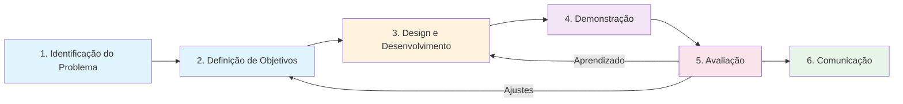
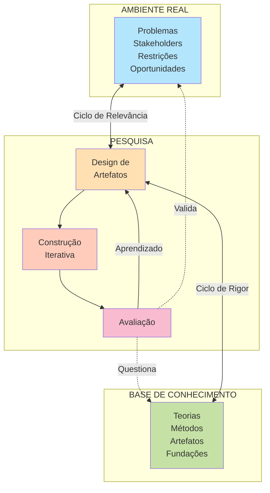
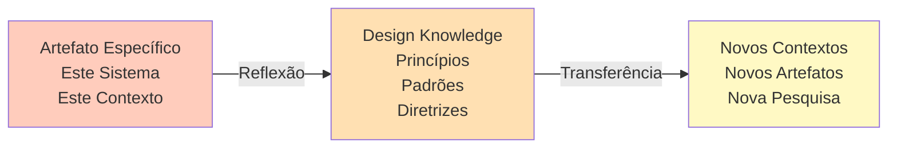
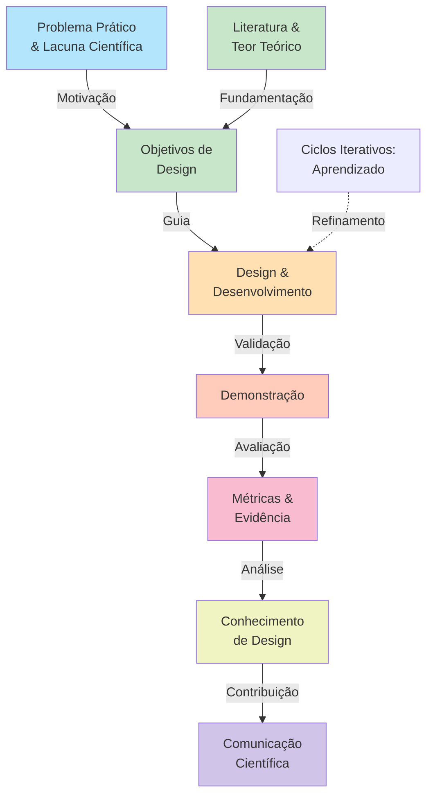

# Design Science Research: Fundamentos, Métodos e Aplicações em Computação

## Introdução

A ciência não se restringe a explicar como o mundo funciona. Ela também pode investigar sistematicamente como construir artefatos que resolvam problemas práticos de forma cientificamente rigorosa. Essa é a essência da Design Science Research (DSR), uma perspectiva de pesquisa que ganhou relevância particular nas áreas de Engenharia, Computação e Sistemas de Informação.

Quando um pesquisador implementa um sistema, cria um algoritmo ou propõe uma arquitetura, ele naturalmente está resolvendo um problema. Mas nem todo artefato produzido constitui pesquisa científica. A diferença fundamental reside em como o problema foi identificado, como os requisitos foram justificados, como o artefato foi construído, como foi avaliado e, especialmente, que conhecimento generalizável foi produzido a partir dessa construção e avaliação.

O objetivo deste material é capacitar pesquisadores e alunos a compreender Design Science Research não como um modo de "validar" uma implementação já pronta, mas como um processo sistemático onde a construção do artefato e a geração de conhecimento científico são indissociáveis. Ao longo dos próximos capítulos, você verá que **DSR não é simplesmente engenharia**. Engenharia responde à pergunta "Como resolver este problema?". Design Science Research responde a "Como construir uma solução que, quando estudada cuidadosamente, produz conhecimento que vale para uma classe mais ampla de problemas?".

## Parte 1: Fundamentos Epistemológicos

### A Tríade das Ciências: Natural, Comportamental e Artificial

Herbert Simon, em *The Sciences of the Artificial* (1969), propôs uma distinção que ainda estrutura o pensamento sobre ciência do design. Ele argumentava que existem fundamentalmente três tipos de empreendimento científico.

- A **ciência natural**: que investiga fenômenos que existem independentemente da ação humana. Um físico estuda como a luz se comporta, um biólogo estuda como os organismos evoluem, um geólogo estuda a formação de rochas. A pergunta central é sempre "Como isso funciona?". O conhecimento é validado mediante observação, experimentação controlada e reprodutibilidade. O mundo existe; a ciência tenta explicá-lo.

- A **ciência comportamental**: que investiga o comportamento de seres humanos e organizações. Um psicólogo estuda como pessoas aprendem, um economista estuda como agentes fazem escolhas, um sociólogo estuda padrões de interação. A pergunta também é frequentemente "Como isso funciona?", mas o objeto é a ação e a decisão humanas. Há rigor metodológico similar ao da ciência natural — delineamentos experimentais, amostragem, testes estatísticos — mas o fenômeno estudado é deliberativo e contextual.

- A **ciência do artificial** (ou design science): que investiga artefatos — coisas que não existem na natureza e que foram deliberadamente criadas por seres humanos para atingir objetivos. Um arquiteto projeta um edifício, um engenheiro projeta um motor, um cientista de computação projeta um algoritmo. A pergunta central não é "Como isso funciona?", mas "Como deveria ser construído para atingir estes objetivos em este contexto específico?". ==O conhecimento não emerge apenas da observação do que existe, mas da construção refletida do que deveria existir.==

Essa distinção é mais que semântica. Ela muda os critérios de rigor científico. Uma **ciência natural** pode validar uma teoria mostrando que suas previsões coincidem com o comportamento observado. Uma **ciência comportamental** pode validar um modelo mostrando que explica variância significativa em dados reais. Uma **ciência do artificial** valida artefatos mostrando que eles funcionam conforme especificado em contextos relevantes e, **mais importante, que sua construção produziu conhecimento que transcende aquele artefato específico.**

### Por Que Design Science Research Importa em Computação

*Design Science Research* é particularmente relevante em Computação porque a área é fundamentalmente engenharia — criamos coisas. **Mas quando uma dissertação de mestrado ou doutorado consiste apenas em "implementamos um sistema", o resultado é desenvolvimento tecnológico, não pesquisa.** 

**A pesquisa emerge quando documentamos sistematicamente o problema que motivava aquela construção**, **o conhecimento que consultamos, as escolhas de design que fizemos, como avaliamos aquelas escolhas e que princípios de design podem ser transferidos para outros contextos.**

Exemplo:

- Considere dois cenários fictícios. No primeiro, um aluno implementa um sistema de detecção de fraude em transações financeiras usando redes neurais, treina em um dataset público, valida com métricas de classificação e conclui sua dissertação. Isso é desenvolvimento competente, talvez até impressionante, mas não é necessariamente pesquisa. 

- No segundo, o mesmo aluno documenta por que a **detecção de fraude é problemática** no contexto específico da organização onde pesquisou, que teorias de segurança e aprendizado de máquina informaram seus requisitos, como iterou entre design e avaliação, que métricas importam para o contexto real (não apenas acurácia genérica), e que princípios de design emergem para sistemas de detecção adaptativa em ambientes onde os padrões de fraude evoluem. Aqui temos pesquisa — o artefato é um meio, não o fim.

https://www.youtube.com/watch?v=d72jkQxwSeQ

## Parte 2: Problemas, Artefatos e Contribuições

### O Conceito de Problema em DSR

Um problema em Design Science Research não é simplesmente qualquer situação incômoda. **Ele é uma lacuna entre um estado desejado e um estado atual**, onde **essa lacuna é relevante tanto para a prática quanto para o conhecimento científico**.

Essa dualidade é crucial. **O problema deve ser relevante para alguém no mundo real** — uma organização que enfrenta um desafio, um grupo de usuários que tem uma necessidade, um contexto onde algo não funciona bem. **Mas também deve ser relevante para a pesquisa — deve revelar uma oportunidade de produzir conhecimento que não existe ou que está incompleto na literatura**.

**Frequentemente, os dois lados estão desalinhados** (referente a relevância do problema para o mundo real e para a pesquisa). Um professor pode observar que alunos têm dificuldade em aprender conceitos de sistemas distribuídos — um problema prático real. Mas se a literatura já contém diversas estratégias pedagógicas bem documentadas e avaliadas, talvez essa lacuna prática não represente uma lacuna científica significativa. Por outro lado, um problema científico pode ser fascinante — "Como integrar inteligência artificial em sistemas de tomada de decisão organizacional de forma que os humanos mantenham agência?" — mas se nenhuma organização real enfrenta isso agora, falta o lado da relevância prática.

**DSR exige que você articule claramente ambos os lados**. Isso frequentemente aparece em duas frases distintas: o **problema prático** (o que está quebrado no mundo real) e a **lacuna científica** (o que não sabemos ainda ou que não está bem documentado).

Exemplo: Um banco descobre que seus analistas de risco gastam horas revisando alertas de fraude que o sistema gera automaticamente. Muitos alertas são falsos positivos, causando fadiga. Os analistas precisam de uma forma mais eficiente de priorizar. Esse é o problema prático. A lacuna científica pode ser "Não temos bem documentados os princípios de design para sistemas de priorização de alertas que equilibrem precisão, recall e carga cognitiva dos operadores em tempo real". Resolvendo a lacuna científica, você resolve a lacuna prática.

### Tipos de A Artefatos

Um artefato em DSR não se restringe a código executável. Hevner e colegas identificam **múltiplas formas que um artefato pode tomar**. Compreender essa diversidade é importante porque muitos pesquisadores reduzem DSR a "criar um software", quando na verdade um artefato pode ser bem mais variado.

Um **constructo** é um conceito ou linguagem que permite descrever um domínio de forma estruturada. Por exemplo, um framework conceitual que organiza os tipos de falhas em sistemas distribuídos é um artefato. Uma taxonomia de estilos arquiteturais para sistemas de tempo real é um artefato. A contribuição não é necessariamente uma implementação, mas uma forma nova e útil de pensar sobre um problema.

Um **modelo** é uma representação abstrata que captura características essenciais de um fenômeno ou processo. Um modelo de propagação de faults em redes de sensores é um artefato. Um modelo de comportamento de usuários em plataformas de e-commerce é um artefato. Modelos frequentemente aparecem em forma de equações, diagramas ou descrições formais.

Um **método** é um processo prescritivo para executar uma tarefa. Um método para elicitar requisitos em ambientes ágeis é um artefato. Um método para integração contínua em equipes distribuídas é um artefato. A diferença entre um método e um processo genérico é que um método DSR é proposto, validado e fundamentado em conhecimento de design específico.

Um **algoritmo** é um procedimento bem definido para resolver uma classe de problemas computacionais. Um algoritmo de balanceamento de carga em clusters é um artefato. Um algoritmo de compressão de dados para redes de baixa banda é um artefato.

Uma **arquitetura** é uma estrutura de componentes, suas relações e propriedades emergentes. Uma arquitetura de microsserviços para aplicações de tempo real é um artefato. Uma arquitetura de processamento de eventos para sistemas IoT é um artefato.

Um **framework** é um conjunto estruturado de conceitos, componentes e processos que podem ser instanciados em diferentes contextos. Um framework para avaliar maturidade de processos DevOps é um artefato. Um framework para integração de sistemas humano-IA em ambientes organizacionais é um artefato.

Uma **instância** ou **protótipo** é uma realização concreta de um ou mais dos anteriores. Uma implementação funcional de um protótipo que demonstra um novo padrão arquitetural é um artefato.

Um **sistema computacional** é um software completo, tipicamente construído para um contexto específico. Um sistema de gestão de aprendizagem para educação híbrida é um artefato.

A importância de nomear corretamente o tipo de artefato vai além de taxonomia. Diferentes tipos de artefatos requerem diferentes estratégias de avaliação. Um algoritmo é avaliado diferentemente de um método. Uma arquitetura é avaliada diferentemente de um constructo. Confundir os tipos pode levar a avaliações inadequadas e, consequentemente, a conclusões frágeis.

### Do Artefato ao Conhecimento: Contribuição Científica

Esse é talvez o ponto mais crítico e frequentemente o mais negligenciado em pesquisas DSR. Construir um artefato não é, por si, contribuição científica. A contribuição emerge quando aquela construção e sua avaliação produzem conhecimento que **transcende o artefato específico**.

Considere um exemplo. Uma pesquisadora implementa um sistema de recomendação para e-books em uma biblioteca pública. O sistema usa um algoritmo de collaborative filtering com certas adaptações para dados esparsos. Ela o treina com dados históricos, o valida com métricas padrão (RMSE, NDCG), o deploy em produção e mede adoção. Tudo funciona bem.

Mas qual é a contribuição científica? Se ela apenas relata "implementamos um sistema de recomendação com estas características e teve estas métricas em produção", a contribuição é limitada. Qualquer desenvolvedor competente poderia fazer o mesmo em uma organização diferente.

A contribuição científica emerge quando ela articula: "Em contextos de dados esparsos combinados com heterogeneidade de preferências de usuários (como em bibliotecas públicas), certos princípios de design — como regularização adaptativa, feedback implícito com ponderação temporal e diversificação de recomendações — produzem melhores resultados que abordagens genéricas. Portanto, para pesquisadores e práticos que enfrentem problemas similares, estas são as dimensões de design relevantes a variar."

A diferença é sutil, mas fundamental. No primeiro caso, ela tem uma implementação. No segundo, ela tem **conhecimento de design** — princípios, diretrizes, entendimento estruturado sobre como artefatos desse tipo devem ser concebidos em contextos com essas características.

**Esse conhecimento de design pode tomar várias formas**:

- **Design principles** são diretrizes sobre como construir artefatos similares. Um exemplo: "Em sistemas de detecção de anomalias onde os padrões normais evoluem temporalmente, incorporar mecanismos de retraining periódico e feedback de especialistas melhora significativamente o valor prático do sistema". Isso não é uma característica do artefato; é um princípio transferível.

- **Design patterns** são soluções recorrentes para problemas de design específicos. "O padrão circuit breaker em sistemas distribuídos" é um artefato que captura solução para um problema estrutural (como lidar com falhas em cascata). Documentar tal padrão com rigor DSR significa descrever precisamente quando é aplicável, que trade-offs produz, e sob quais condições.

- **Taxonomies e typologies** organizam o espaço de soluções possíveis. Uma tipologia de estratégias de cache em ambientes de edge computing, por exemplo, articulando dimensões relevantes e trade-offs, é um conhecimento de design valioso.

- **Process knowledge** descreve como executar efetivamente uma classe de tarefas. Um processo para migrar aplicações legacies para microsserviços, baseado em lições aprendidas em múltiplos contextos, é conhecimento de design.

- **Theoretical insights** são entendimentos sobre por que certos designs funcionam melhor que outros em contextos específicos. Se você descobre que em sistemas críticos, descentralização de decisões reduz latência mas aumenta complexidade operacional, você tem um insight teórico valioso.

## Parte 3: O Processo DSRM de Peffers

Uma das contribuições mais influentes para estruturar DSR foi a proposição do **Design Science Research Methodology** (DSRM), formulada por Peffers e colegas em 2007. O DSRM pode ser pensado como o "algoritmo básico" de uma pesquisa em Design Science.

O processo consiste em seis fases principais. A primeira é **identificação do problema e motivação**. Nesta fase, você articula claramente qual é o problema que sua pesquisa aborda, por que importa (para a prática, para a ciência ou ambos) e que conhecimento existente é relevante. Você não está apenas identificando um problema vago; está justificando por que ele merece ser estudado e por que uma abordagem de design science é apropriada.

A segunda fase é **definição dos objetivos da solução**. Baseado no problema e no conhecimento existente, você articula explicitamente o que a solução deveria alcançar. Esses objetivos frequentemente são expressos em termos quantitativos (reduzir latência em 30%, aumentar precisão para acima de 95%) ou qualitativos (melhorar usabilidade para usuários não-técnicos). Objetivos bem definidos são críticos porque eles guiam tanto o design quanto a avaliação.

A terceira fase é **design e desenvolvimento**. Aqui você constrói o artefato. Mas construção fundamentada significa que cada decisão de design é informada por teoria, por conhecimento prévio ou por princípios de design identificados. Você não está simplesmente implementando; está argumentando por que cada escolha arquitetural, cada componente, cada algoritmo é apropriado.

A quarta fase é **demonstração**. Você apresenta o artefato funcionando em um contexto relevante. Isso pode ser um ambiente controlado (um laboratório), um ambiente real (uma organização), ou um simulado (um dataset que emula características do problema real). A demonstração estabelece que o artefato pode, de fato, funcionar.

A quinta fase é **avaliação**. Aqui você compara sistematicamente o desempenho do artefato contra os objetivos que definiu. Você responde rigorosamente: "O artefato alcança os objetivos? Em que condições? Quais trade-offs ele faz?". Sem avaliação rigorosa, você não tem evidência de que o design funcionou.

A sexta fase é **comunicação**. Você articula os resultados em forma que a comunidade científica e os práticos podem compreender, reproduzir e construir sobre eles. Isso tipicamente significa um artigo científico, uma dissertação, ou documentação técnica bem estruturada.

Importante ressaltar que o DSRM **não é necessariamente linear**. Na prática, a maioria das pesquisas DSR envolvem ciclos: você projeta, avalia, aprende algo, redesenha, avalia novamente. Essa iteração é natural e esperada. O DSRM fornece uma estrutura que vale para cada ciclo, mas múltiplos ciclos podem ocorrer em uma mesma pesquisa.

### Exemplo Prático do DSRM: Sistema de Priorização de Alertas SOC

Para tornar concreto, vamos traçar como o DSRM aplicaria-se a um problema de segurança da informação.

**Problema e Motivação:** Centers de Operações de Segurança (SOC) em grandes organizações enfrentam centenas de milhares de alertas por dia, originados de firewalls, sistemas de prevenção de intrusão, detecção baseada em comportamento, logs de aplicações. Os analistas têm taxa de burnout elevada, porque a maioria dos alertas são false positives. Enquanto isso, alertas genuinamente críticos podem ser perdidos no ruído. A lacuna científica é que não temos bem documentados os princípios de design que balanceiem precisão, recall, e carga cognitiva dos operadores em sistemas de priorização de alertas com grande volume.

**Objetivos da Solução:** Reduzir o número de alertas que um analista precisa revisar em 40% (mantendo recall de ameaças reais acima de 95%), reduzir o tempo médio para triagem de um alerta de 5 minutos para 2 minutos, e receber feedback positivo dos analistas quanto a utilidade do sistema.

**Design e Desenvolvimento:** Você propõe uma arquitetura que combina três componentes. Primeiro, um sistema de regras baseado em inteligência de ameaças que filtra alertas conhecidamente falsos (por exemplo, alertas de varredura de portas de laboratórios inteiros). Segundo, um modelo de machine learning que aprende com histórico de decisões dos analistas (que alertas foram investigados, quais foram ignorados). Terceiro, um módulo que fornece contexto: cada alerta é enriquecido com informações sobre o ativo afetado, histórico recente de atividades naquele ativo, e reputação de endereços IP envolvidos. Cada escolha é fundamentada em literatura sobre triagem de alertas de segurança e sobre redução de sobrecarga cognitiva.

**Demonstração:** Você treina o sistema com 3 meses de dados históricos de um SOC real, sem alterar nenhuma operação. Você mostra que o sistema executa como esperado, que as decisões são explicáveis, que os analistas conseguem compreender por que um alerta foi prioritário.

**Avaliação:** Com a participação de 5 analistas de segurança, você executa um experimento controlado. Cada analista processa 200 alertas reais sem o sistema (baseline), depois processa 200 com o sistema, em ordem aleatória para evitar viés. Você mede: (a) número de alertas revisados para encontrar o mesmo número de ameaças reais (redução de sobrecarga), (b) precisão e recall em identificar ameaças (funcionalidade), (c) tempo por alerta (eficiência), (d) feedback qualitativo sobre usabilidade. Os resultados mostram redução de 38% em alertas revisados, precisão de 94% em ameaças reais, redução de 55% em tempo por alerta, e feedback positivo dos analistas sobre confiança no sistema.

**Comunicação e Conhecimento de Design:** Você conclui que, para sistemas de priorização em SOCs: (1) integração de inteligência de ameaças externa é crítica e deve ser atualizada em tempo real; (2) contexto sobre ativos e histórico reduz significativamente false positives percebidos pelos analistas (mesmo se a acurácia bruta não melhora muito); (3) explicabilidade do sistema é tão importante quanto acurácia para que analistas confiem; (4) feedback contínuo dos analistas é necessário, não apenas durante design, mas continuamente em produção. Esses são princípios de design transferíveis para outros contextos similares.

## Parte 4: Os Ciclos de Hevner

Enquanto o DSRM de Peffers fornece uma estrutura sequencial, Hevner propôs uma visão mais cíclica e equilibrada entre três dimensões simultâneas: **ciclo de relevância**, **ciclo de rigor** e **ciclo de design**.

O **ciclo de relevância** conecta a pesquisa ao ambiente real. Nele, você continuamente valida que o problema que está resolvendo é relevante na prática. Que as pessoas ou organizações que vivem esse problema de fato veem valor em uma solução. Que as restrições e oportunidades do ambiente real são compreendidas. O ciclo de relevância começa com observação e entrevistas no ambiente, passa por definição de requisitos com stakeholders reais, e retorna continuamente para validação.

O **ciclo de rigor** conecta a pesquisa ao corpo de conhecimento existente. Nele, você consulta teorias, métodos e artefatos já documentados. Você evita reinventar o que já existe. E você contribui criticamente: ao identificar lacunas na literatura, ao questionar suposições em trabalhos anteriores, ao propor sínteses que integram várias perspectivas. O ciclo de rigor envolve revisão sistemática da literatura, compreensão profunda de fundações teóricas, e diálogo com trabalhos relacionados.

O **ciclo de design** conecta a construção refletida ao teste e aprendizado. Nele você propõe uma solução, a constrói (ou a simula), a avalia em contexto controlado, aprende com os resultados, refina o design e repete. Frequentemente, um ciclo de design passa por múltiplas iterações antes de estar pronto para validação em ambientes reais.

Esses três ciclos não ocorrem sequencialmente; eles ocorrem em paralelo, alimentando-se mutuamente. Uma descoberta no ciclo de design pode exigir revisão da literatura (ciclo de rigor). Uma observação no ambiente real (ciclo de relevância) pode questionar uma suposição de design. Um novo conhecimento em uma teoria relevante (ciclo de rigor) pode abrir novas possibilidades de design.

Didaticamente, o modelo dos ciclos de Hevner ajuda a explicar por que uma dissertação DSR que "apenas implementa um sistema" é incompleta. Uma implementação sem ciclo de relevância suficiente corre o risco de resolver um problema que não é real. Uma implementação sem ciclo de rigor corre o risco de ignorar soluções já existentes ou de violar princípios teóricos estabelecidos. Uma implementação sem ciclo de design iterativo corre o risco de fazer escolhas de design não reflexivas.

## Parte 5: Avaliação em Design Science Research

A avaliação é frequentemente o ponto fraco em dissertações DSR. Ouve-se com frequência relatórios como "o protótipo funcionou bem" ou "os usuários gostaram". Mas sem rigor, essas afirmações não constituem evidência científica.

Rigor em avaliação começa com clareza sobre o que está sendo avaliado. São pelo menos três coisas distintas que frequentemente se confundem:

O **artefato** é a coisa que você construiu — o algoritmo, o sistema, o método, a arquitetura. A pergunta é: "Ele faz o que se propõe a fazer?".

A **avaliação** é a evidência de que o artefato funciona conforme especificado. A pergunta é: "Qual é a evidência?".

A **contribuição científica** é o conhecimento que você produziu ao construir e avaliar o artefato. A pergunta é: "O que aprendemos que transcende este artefato específico?".

Essas três coisas devem aparecer de forma claramente distinta em uma pesquisa DSR. Um artefato sem avaliação é um protótipo; não é pesquisa. Uma avaliação sem reflexão sobre contribuição científica é teste de produto; não é pesquisa. Pesquisa é quando os três estão presentes e conectados.

### Estratégias de Avaliação

Existem múltiplas estratégias de avaliação, cada apropriada para contextos e tipos de artefatos diferentes. A literatura em DSR distingue entre avaliação **artificial** versus **naturalística**, e entre avaliação **formativa** versus **somativa**.

A avaliação artificial ocorre em ambientes controlados, frequentemente em laboratório. Você cria um cenário específico, você controla as variáveis, você mede resultados. O benefício é precisão e controlabilidade. A limitação é que o mundo real frequentemente é mais complexo e menos previsível que o laboratório. Um algoritmo pode funcionar perfeitamente em um dataset de teste e falhar em dados reais com características diferentes.

A avaliação naturalística ocorre no ambiente real, com usuários ou contextos reais. Você observa o artefato em uso, você coleta dados do ambiente real, você mede outcomes que importam na prática. O benefício é autenticidade. A limitação é falta de controle — múltiplas variáveis estão mudando simultaneamente, há interferência, é difícil isolar a contribuição específica do seu artefato.

A avaliação formativa ocorre durante o desenvolvimento. Você testa protótipos parciais, você coleta feedback de usuários, você usa essa informação para refinar o design. O objetivo é melhorar o artefato, não necessariamente validar sua eficácia final.

A avaliação somativa ocorre ao final do desenvolvimento. Você testa o artefato completo contra seus objetivos. O objetivo é demonstrar que o artefato alcança seus objetivos em contextos relevantes.

Uma pesquisa DSR robusta tipicamente combina múltiplas estratégias. Você começa com avaliação artificial e formativa — prototipagem rápida, testes em laboratório, refinamento baseado em feedback de especialistas. Uma vez que o design está mais maduro, você passa para avaliação artificial somativa — testes rigorosos em ambientes controlados com métricas bem definidas. Se o artefato é destinado ao uso prático, você idealmente complementa com avaliação naturalística — teste em contexto real com stakeholders reais.

### Métricas e Medição

A medição é onde muita pesquisa DSR falha. Perguntas como "funcionou?" são vagas demais. Funcionou em relação a quê? Para quem? Em quais condições?

Uma estrutura útil é: **objetivo → critério → métrica → experimento → evidência**.

Suponha que seu objetivo é "melhorar usabilidade de um sistema de gestão de projetos para usuários não-técnicos". O critério é então algo como "usuários devem ser capazes de completar as tarefas principais em tempo razoável com poucos erros". As métricas específicas podem ser "tempo para completar três tarefas padrão", "número de cliques necessários", "taxa de erros", "pontuação SUS (System Usability Scale)". O experimento é então o delineamento específico — quantos usuários participam, como são recrutados, que tarefas executam, qual é o controle (versão anterior do sistema?). E a evidência são os dados coletados no experimento.

Diferentes tipos de objetivos exigem diferentes métricas. Se o objetivo é performance computacional, você mede tempo de execução, uso de memória, throughput. Se é precisão de um classificador, você mede acurácia, precisão, recall, ROC-AUC. Se é usabilidade, você mede tempo de execução de tarefas, taxa de erros, satisfação do usuário. Se é escalabilidade de uma arquitetura, você mede latência sob diferentes cargas, disponibilidade, throughput máximo sustentável. Se é transferibilidade de um método, você executa o método em múltiplos contextos e mede se produz resultados similares.

Uma armadilha comum é confundir métricas técnicas com métricas que importam. Um sistema pode ter excelente precisão em classificação, mas se precisão não é o que importa no contexto real (talvez recall seja mais crítico, ou talvez o custo de falsos positivos seja aceitável), a métrica é irrelevante. Sempre volta-se à pergunta: "Qual é o objetivo real do artefato neste contexto?".

### Desenho Experimental

A qualidade de uma avaliação depende também do desenho do experimento. Alguns princípios:

**Definição clara de variáveis.** Qual é a variável independente (o que você está manipulando — a presença do seu artefato vs. ausência, ou uma versão vs. outra)? Qual é a variável dependente (o que você está medindo como resultado)? Quais são as variáveis de controle (características do contexto que você quer manter constantes ou pelo menos medir)?

**Baseline e controle.** Você não avalia seu artefato em vácuo. Você o compara contra algo — a situação anterior (baseline), uma solução existente (controle), ou uma hipótese nula. Sem comparação, é impossível saber se seus resultados são significativos.

**Amostra adequada.** Quantos participantes, quantos exemplos, quantas replicatas são necessários? A resposta depende de qual é a magnitude de efeito que você espera, qual é o nível de variância nos dados, e qual é o seu nível de confiança desejado. Em avaliações pequenas com poucos participantes, tome cuidado em extrapolar conclusões.

**Neutralidade.** Há viés? Aquele que administra o experimento sabe qual é a versão experimental vs. controle, causando viés de expectativa? Os participantes sabem que estão sendo testados, causando efeito Hawthorne? Use delineamentos cegos quando possível.

**Contexto apropriado.** A avaliação acontece em contexto relevante para o problema? Um algoritmo de compressão avaliado em datasets acadêmicos pode não refletir seu desempenho em dados reais de produção. Um método de colaboração avaliado com estudantes pode não refletir seu desempenho com profissionais sob pressão.

### Estudos de Caso e Avaliações Qualitativas

Nem toda avaliação DSR precisa de métricas quantitativas e experimentos controlados. Especialmente em fases iniciais, ou quando o artefato é complexo e contextualmente dependente, avaliações qualitativas são apropriadas.

Um **estudo de caso** examina um artefato em profundidade em um contexto específico. Você não está generalizando para população; você está compreendendo como o artefato funciona em detalhe naquele contexto, que desafios surgiram, como foram resolvidos, que insights emergiram. Um estudo de caso é frequentemente conduzido com métodos etnográficos — observação, entrevistas, análise de artefatos produzidos. O valor científico emerge da riqueza de detalhe e da capacidade de articular novos insights que não eram óbvios antes.

**Entrevistas estruturadas** com usuários ou especialistas podem fornecer feedback valioso. Por exemplo, após os usuários terem operado seu artefato, você os entrevista de forma estruturada sobre aspectos específicos — que foi fácil, que foi difícil, que características faltam, como isso muda a forma como trabalham. As respostas fornecem dados qualitativos que complementam métricas quantitativas.

**Análise de conformidade** compara o comportamento do artefato contra um padrão ou especificação. Por exemplo, se seu artefato é um método para refatoração de código, você pode aplicar o método e depois analisar se o código refatorado mantém funcionalidade, se reduz complexity, se melhora legibilidade — não via métricas numéricas, mas via análise detalhada.

A força das avaliações qualitativas é que elas podem capturar nuances que métricas simples perdem. A limitação é que são mais trabalhosas e menos facilmente replicáveis.

## Parte 6: De Pesquisa a Conhecimento de Design

O ponto culminante de um projeto DSR não é o artefato; é o conhecimento de design que você articula. Um artefato é específico de um contexto. Conhecimento de design é transferível.

A passagem do artefato específico para conhecimento generalizado requer reflexão sistemática. A literatura em DSR oferece alguns frameworks para pensar nisso.

**Gregor e Hevner** propõem que a contribuição de uma pesquisa DSR pode ser situada em uma matriz onde um eixo é o grau de novidade/maturity da solução (incremental vs. radical) e outro eixo é o grau de maturity do conhecimento do domínio (problema bem entendido vs. pouco compreendido). Pesquisas que lidam com problemas bem compreendidos e propõem soluções incrementais têm foco em rigor e eficiência. Pesquisas que lidam com problemas pouco compreendidos e propõem soluções radicais têm foco em exploração e geração de novos insights. Essa matriz ajuda a posicionar sua contribuição.

Uma forma concreta de articular conhecimento de design é através de **design principles**. Um design principle é uma diretrização de como artefatos similares devem ser construídos em contextos com características similares. Por exemplo, baseado em sua pesquisa sobre detecção de fraude, você pode articular: "Em sistemas de detecção de fraude em contextos de alta transação, a incorporação de retroalimentação contínua de operadores, combinada com retraining periódico do modelo, reduz significativamente taxa de falsos positivos ao longo do tempo, sem sacrificar recall".

Outro formato é documentar **trade-offs de design**. "Entre uma arquitetura centralizada (mais fácil de manter consistência) vs. descentralizada (mais resiliente a falhas), quando a prioridade é resiliência e o volume de dados supera X transações por segundo, descentralização é o trade-off apropriado". Essas articulações de trade-off são valiosas porque não prescrevem uma única solução; elas descrevem as dimensões relevantes de decisão.

Ainda outro formato é uma **process guide** — documentação estruturada de como executar uma classe de tarefas. Por exemplo, um guia para migração de sistemas monolíticos para microsserviços, baseado em experiência em múltiplos contextos, articulando fases, decisões críticas, armadilhas comuns e critérios de sucesso.

A qualidade do conhecimento de design que você produz depende criticamente de **como você o articula**. Um princípio vago ("use feedback de usuários") é de pouca utilidade. Um princípio bem articulado especifica **quando** é aplicável, **por que** funciona, **quais** trade-offs produz, e **em quais condições** pode falhar.

## Parte 7: Design Science Research Contemporânea

A pesquisa em Design Science Research continuou evoluindo. Desenvolvimentos recentes chamam atenção para dimensões que, historicamente, receberam menos ênfase.

### Transparência e Reprodutibilidade

Um movimento crescente em design science enfatiza que **não basta validar que o artefato funciona; você deve documentar como você chegou àquele artefato, que decisões você tomou, por que as tomou, e de que forma alguém poderia reproduzir seu trabalho**.

Isso inclui: versionar o código do artefato (tipicamente em repositórios como GitHub), documentar decisões arquiteturais (frequentemente em ADRs — Architecture Decision Records), publicar datasets usados em avaliação (quando possível, respeitando privacidade), descrever explicitamente os procedimentos de avaliação (delineamento experimental, critérios de seleção de participantes, protocolos de coleta de dados), e publicar instrumentos usados (questionários, roteiros de entrevista).

Um framework recente (Storey, 2025) estrutura **confiabilidade em Design Science Research** em torno de confiabilidade do artefato (ele realmente funciona como especificado?), confiabilidade dos métodos (a avaliação foi conduzida rigorosamente?), confiabilidade das medidas (as métricas realmente capturam o que pretende medir?), e confiabilidade do conhecimento de design (o conhecimento extraído é válido e transferível?). Essa perspectiva amplia o escopo de rigor: não é apenas sobre a funcionalidade do artefato, é sobre toda a cadeia de pesquisa.

Ciência aberta e reprodutibilidade não são luxo; eles aumentam significativamente o valor científico do trabalho. Um artefato que não pode ser reproduzido por outros pesquisadores é de pouca utilidade científica, ainda que funcionasse bem uma vez.

### Responsible Design e Valores

Um segundo desenvolvimento é o reconhecimento de que **artefatos incorporam valores**. Não existem artefatos neutros. Um sistema de recomendação otimizado para engagement pode aumentar polarização. Um algoritmo de contratação treinado em dados históricos pode perpetuar discriminação. Uma interface desenhada para máxima conversão pode ser manipuladora.

**Responsible Design** ou **Value-Sensitive Design** são abordagens que incorporam explicitamente considerações éticas, sociais e de sustentabilidade no design. Em vez de apenas perguntar "funciona?", pergunta-se também "para quem funciona?", "quem é afetado (até de formas não óbvias)?", "quais valores estão sendo privilegiados?", "como poderia ser abusado?".

Na prática, isso significa envolver stakeholders diversificados no design (não apenas usuários primários, mas pessoas afetadas), documentar explicitamente valores de design, fazer análises de impacto social e ambiental, e avaliar o artefato não apenas por eficácia, mas por consequências éticas.

Um exemplo: Uma organização desenvolve um sistema de priorização de crédito para microfianças. Responsabilidade design significa não apenas otimizar aprovação rápida e redução de taxa de default (metas de negócio), mas também examinar se o sistema discrimina grupos minoritários, qual o impacto em comunidades vulneráveis, e quais são as limitações e riscos comunicados aos tomadores de decisão.

### Design Science Research e Inteligência Artificial

Um terceiro desenvolvimento é o crescimento de pesquisas DSR que envolvem sistemas de IA, especialmente em contextos de interação humano-IA e sistemas com IA generativa.

A literatura recente tem explorado como design sistemas onde humanos e IA trabalham juntos — não apenas substituição automática, mas colaboração refletida. Como desenhar interfaces que comunicam ao humano o que a IA está fazendo e por que, permitindo que o humano mantenha agência? Como desenhar workflows que tirem proveito das forças de ambos — criatividade humana e processamento rápido da IA?

A própria IA generativa também está sendo utilizada dentro de processos de pesquisa. Há exemplos de DSR usando GenAI para ajudar na geração de requisitos, na síntese de literatura, na ideação de designs alternativos. Isso abre uma questão epistemológica interessante: **se a IA participa na construção do artefato, onde está a contribuição do pesquisador?** A resposta emergente é que a contribuição está cada vez menos em "implementar" e cada vez mais em "formular, justificar, validar conhecimento de design".

Para aqueles que utilizam GenAI em pesquisa DSR, recomenda-se documentar explicitamente qual foi o papel da IA (ajudou na codificação? na síntese de literatura? em ideação?), como resultados foram validados (em vez de aceitar output de GenAI sem crítica), e como isso pode ter influenciado o resultado final.

## Parte 8: Estrutura de um Projeto DSR

Colocando tudo junto, um projeto DSR completo tipicamente tem esta estrutura:

**Definição clara do problema** que situa a pesquisa no ambiente prático (relevância) e no conhecimento acadêmico (lacuna científica). Essa seção frequentemente começa com observação ou dados do ambiente real que motivam o trabalho.

**Revisão sistemática de conhecimento relacionado** que mapeia o que já existe e identifica explicitamente aonde está a oportunidade de contribuição. Essa revisão deve cobrir três dimensões: solução prévias (artefatos similares), teor teórico relevante (frameworks, modelos, teorias), e métodos e instrumentos de avaliação.

**Articluação de objetivos de design** que especificam precisamente o que a solução deveria alcançar. Esses objetivos devem ser traçáveis aos requisitos que emerged da análise do problema.

**Design e desenvolvimento do artefato**, documentado de forma que alguém pudesse compreender e potencialmente reproduzir as decisões tomadas. Para software, isso significa código versionado e comentado. Para métodos, significa descrição passo-a-passo. Para modelos, significa formalismo explícito.

**Demonstração** do artefato funcionando em contexto relevante, com suficiente detalhe para que o leitor entenda que funciona.

**Avaliação rigorosa** contra os objetivos de design, com múltiplas estratégias (artificial + naturalística, formativa + somativa) quando apropriado, com métricas bem definidas, com controles experimentais onde possível, e com transparência sobre limitações.

**Reflexão e síntese** onde você extrai conhecimento de design do trabalho específico. Como você articula o que aprendeu de forma que seja transferível a outros contextos?

**Comunicação clara** estruturada de forma que alguém lendo seu trabalho compreenda não apenas o que você fez, mas por que cada parte importa, como se conectam, e que valor científico foi produzido.

## Conclusão

Design Science Research é a perspectiva apropriada quando sua pergunta de pesquisa é "Como deveria ser construído para resolver esta classe de problemas de forma melhor?". Ela requer rigor na definição de problemas, na fundamentação teórica, na iteração entre design e avaliação, e especialmente na reflexão sobre que conhecimento de design foi produzido.

A diferença entre "implementar um sistema" e "conduzir uma pesquisa em Design Science" reside exatamente aí: no rigor com que você articula problema, fundamentação, design, avaliação e contribuição. Um engenheiro pode implementar sem essas formalidades. Um pesquisador, quando usa DSR, aceita que cada uma dessas dimensões importa e que o valor final está não no código, mas no conhecimento que emerge da construção e validação refletida daquele código.

---

## Referências

Gregor, S., & Hevner, A. R. (2013). Positioning and presenting design science research for maximum impact. *MIS Quarterly, 37*(2), 337-355.

Hevner, A. R., March, S. T., Park, J., & Ram, S. (2004). Design science in information systems research. *MIS Quarterly, 28*(1), 75-105.

Peffers, K., Tuunanen, T., Rothenberger, M. A., & Chatterjee, S. (2007). A design science research methodology for information systems research. *Journal of Management Information Systems, 24*(3), 45-77.

Storey, M. A. (2025). Reliability in design science research. *Information Systems Journal*.

Simon, H. A. (1996). *The sciences of the artificial* (3rd ed.). MIT Press.

Taylor & Francis Online. *A Design Science Research Methodology for Information Systems Research*. Journal of Management Information Systems, Vol 24, No 3.

Wiley Online Library. (2025). Reliability in design science research - Storey - Information Systems Journal.

ScienceDirect. Transparency in design science research.

JMIR Medical Education. (2024). Cocreating an Automated mHealth Apps Systematic Review Process With Generative AI: Design Science Research Approach.

Springer Nature Link. (2025). Design Science Across Disciplines: Building Bridges for Advancing Impactful Business Research. Schmalenbach Journal of Business Research.
